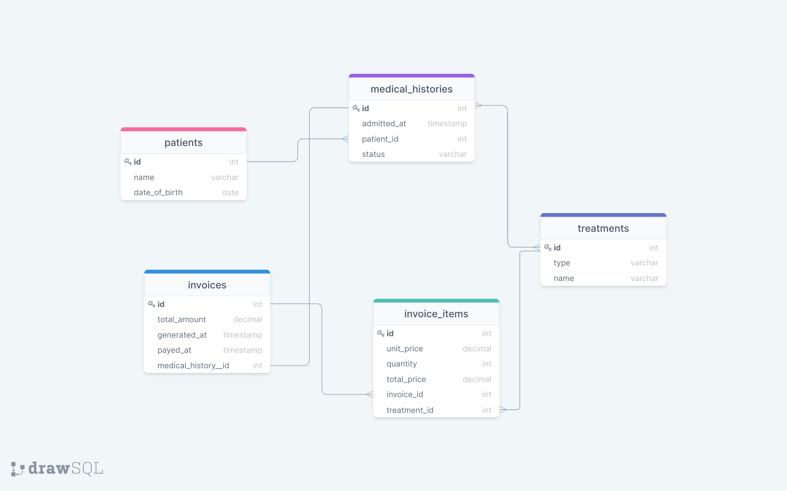

# Hospital Database

> An educational project to create a database from a Schema Diagram

## Getting Started

This repository includes files with plain SQL that can be used to recreate a database:

- Use [schema_based_on_diagram.sql](./schema_based_on_diagram.sql) to create all tables.

## Authors

👤 **Awais Amjed**

- GitHub: [Awais Amjed](https://github.com/awais-amjed)
- Website: [Coding Fries](https://codingfries.com)
- LinkedIn: [LinkedIn](https://www.linkedin.com/in/awais-amjed)

👤 **Salim Abdulai**

- GitHub: [@RayhanTabase](https://github.com/RayhanTabase)
- Twitter: [@RayhanTabase](https://twitter.com/@RayhanTabase)
- LinkedIn: [Salim-Abdulai](https://linkedin.com/in/salim-abdulai-5430065b)
- Email: salimabdulai2@yahoo.com

## 🤝 Contributing

Contributions, issues, and feature requests are welcome!

Feel free to check the [issues page](../../issues/).

## Show your support

Give a ⭐️ if you like this project!

## Acknowledgments

- Microverse

## 📝 License

This project is [MIT](./LICENSE) licensed.
